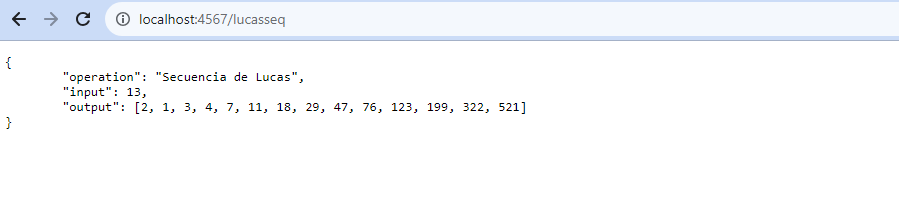
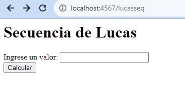
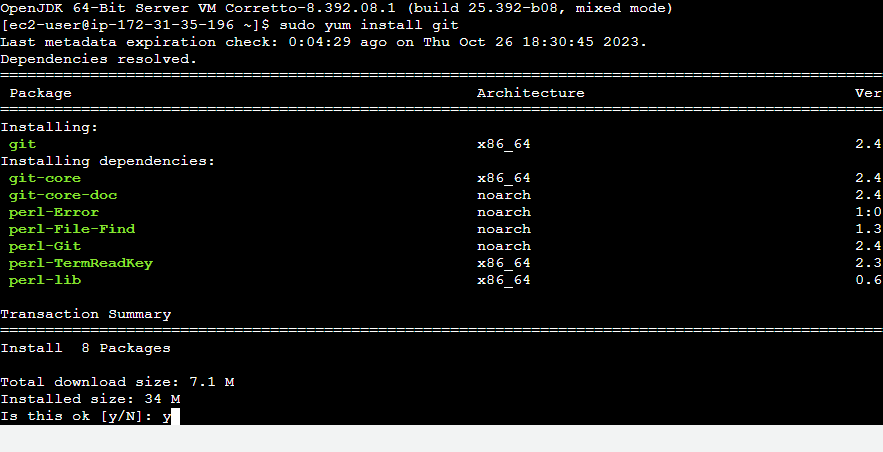
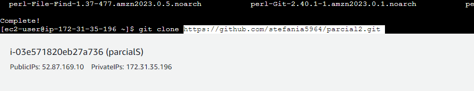
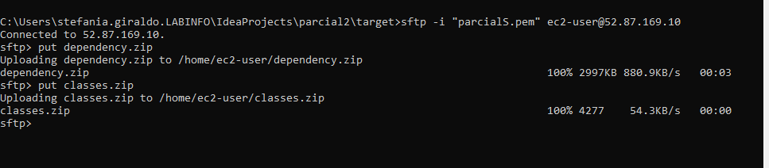

### PARCIAL2

## stefania Giraldo
### installing

´´´
git clone https://github.com/stefania5964/parcial2.git
´´´

ejecuta
´´´
mvn package
´´´
inicia
´´´
mvn exec:java
´´´
puerto
´´´´
localhost:4567
´´´´
primero miramos si se esta ejecutando correctmente y nos muestra lo que necesitamos

con json

se genera el puerto en la seguridad

luego lo instalamos en aws

